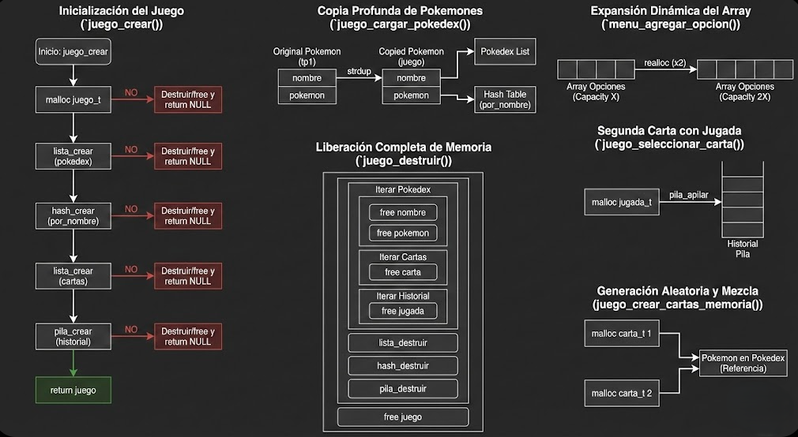
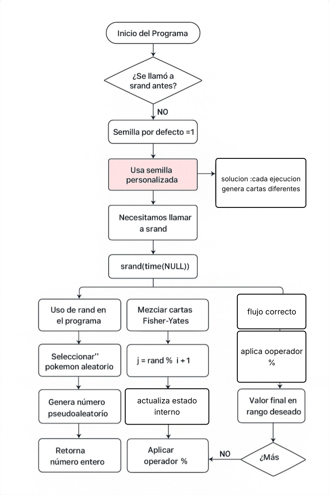

<div align="right">

</div>

# TP2

## Repositorio de (Nombre Apellido) - (Padrón) - (Mail)

- Para compilar:

```bash
gcc -std=c99 -Wall -Wconversion -Wtype-limits -pedantic -Werror -O2 -g src/*.c tp2.c -o tp2
```

- Para ejecutar:

```bash
./tp2
```

- Para ejecutar con valgrind:
```bash
valgrind --leak-check=full --track-origins=yes --show-reachable=yes --show-leak-kinds=all ./tp2
```

- Para compilar las pruebas:

```bash
gcc -std=c99 -Wall -Wconversion -Wtype-limits -pedantic -Werror -O2 -g src/*.c pruebas_alumno.c -o pruebas_alumno
```

- Para ejecutar las pruebas con valgrind:

```bash
valgrind --leak-check=full --track-origins=yes --show-reachable=yes --error-exitcode=2 --show-leak-kinds=all ./pruebas_alumno
```
---
##  Funcionamiento

### Descripción General

El TP2 implementa un juego de memoria (memotest) de pokemones con un sistema de menús interactivo. El programa utiliza estructuras de datos (lista, pila, ABB, hash) para gestionar la información de pokemones y las partidas.

---

## TDA Menu (`menu.h`)

### Primitivas Principales

**menu_t *menu_crear()**
- Crea un menú con un título personalizado y un estilo visual (MINIMALISTA, BORDES, o RETRO)
- Si el título es NULL, usa "MENU" por defecto
- Retorna un puntero al menú creado o NULL en caso de error
- **Complejidad**: O(n) donde n es la longitud del título (por `strdup`)

**menu_t *menu_agregar_opcion()**
- Agrega una opción al menú con una tecla asociada
- Puede tener una acción (callback) o un submenú, pero no ambos
- Si la tecla ya existe, reemplaza la opción anterior
- El array de opciones se expande dinámicamente según sea necesario
- **Complejidad**: O(m) en el peor caso, donde m es la cantidad de opciones actuales (buscar tecla existente + posible realloc). O(1) amortizado para agregar al final

**enum estilo_menu menu_obtener_estilo()**
- Retorna el estilo actual del menú
- Si el menú es NULL, retorna ESTILO_MINIMALISTA por defecto
- **Complejidad**: O(1)

**menu_t *menu_cambiar_estilo()**
- Cambia el estilo del menú de forma cíclica: MINIMALISTA → BORDES → RETRO → MINIMALISTA
- Retorna el mismo menú con el estilo actualizado
- **Complejidad**: O(1)

**void menu_destruir()**
- Libera toda la memoria asociada al menú
- Destruye recursivamente los submenús
- No libera los contextos de usuario (`ctx`)
- **Complejidad**: O(m × k) donde m es la cantidad total de opciones y k es la profundidad máxima de submenús (recursión)

### Funcionamiento del Sistema de Menús

El menú se implementa con un array dinámico de opciones que crece según sea necesario (similar al TP1). Cada opción tiene:
- Una tecla (char) como identificador
- Una descripción (string)
- Una acción (función callback) o un submenú (pero no ambos)
- Un contexto de usuario que se pasa a la acción

El menú soporta navegación jerárquica mediante submenús, permitiendo crear estructuras complejas de navegación.


<div align="center">

</div>

---

## TDA Juego (juego.h)

### Primitivas de Inicialización

**`juego_t *juego_crear()`**
- Crea una nueva instancia del juego
- Inicializa las estructuras internas: lista (pokedex), hash (búsqueda por nombre), lista (cartas), pila (historial)
- Retorna el juego creado o NULL en caso de error
- **Complejidad**: O(1)

<div align="center">

</div>

**int juego_cargar_pokedex()**
- Carga pokemones desde un archivo CSV
- **Importante**: Crea copias profundas de cada pokemon (no guarda referencias directas)
- Retorna la cantidad de pokemones cargados o -1 en caso de error
- Los pokemones se almacenan en una lista y también en un hash para búsquedas rápidas por nombre
- **Complejidad**: O(n × m) donde n es la cantidad de pokemones y m es el promedio de caracteres por nombre (lectura + copia profunda + inserción en hash)

---

**void juego_destruir()**
- Libera toda la memoria del juego
- Destruye los pokemones copiados (tanto nombres como estructuras)
- Libera las cartas y el historial de jugadas
- **Complejidad**: O(n) donde n es la cantidad de pokemones cargados

### Primitivas de Consulta

**size_t juego_cantidad_pokemones()**
- Retorna la cantidad de pokemones cargados en la pokedex
- **Complejidad**: O(1)

**size_t juego_buscar_por_nombre()**
- Busca pokemones cuyo nombre contenga la subcadena especificada
- Utiliza búsqueda lineal con `strstr` para encontrar coincidencias parciales
- Llena el array de resultados hasta `max_resultados`
- **Complejidad**: O(n × m) donde n es la cantidad de pokemones y m es la longitud promedio de los nombres

**pokemon_t *juego_buscar_por_id()**
- Busca un pokemon por su ID exacto
- Utiliza un iterador sobre la lista de pokemones
- **Complejidad**: O(n) donde n es la cantidad de pokemones (búsqueda lineal)

**void juego_listar_por_nombre(juego_t *juego, void )**
- Lista todos los pokemones ordenados alfabéticamente por nombre
- Crea un ABB temporal para ordenar, extrae los elementos en inorden, y ejecuta la acción sobre cada uno
- **Complejidad**: O(n log n) en promedio, O(n²) en el peor caso (ABB desbalanceado), donde n es la cantidad de pokemones

**void juego_listar_por_id(juego_t *juego, void )**
- Lista todos los pokemones ordenados por ID
- Utiliza el mismo mecanismo de ABB temporal que el listado por nombre
- **Complejidad**: O(n log n) en promedio, O(n²) en el peor caso, donde n es la cantidad de pokemones

---

### Primitivas de Partida

**bool juego_iniciar_partida()**
- Inicia una nueva partida con al menos 9 pokemones
- Genera 18 cartas (9 pares) seleccionando pokemones aleatoriamente
- Las mezcla usando el algoritmo Fisher-Yates
- Si la semilla es 0, usa el tiempo actual
- **Complejidad**: O(1) ya que siempre genera 18 cartas fijas

'''
<div align="center">

</div>
'''

---
**juego_partida_activa()**
- Verifica si hay una partida en curso (con 18 cartas en el tablero)
- **Complejidad**: O(1)

**
 juego_jugador_actual()**
- Retorna el jugador actual (1 o 2)
- Retorna 0 si no hay partida activa
- **Complejidad**: O(1)

---
**size_t juego_obtener_tablero()**
- Copia el estado actual de las 18 cartas al array proporcionado
- Cada carta contiene: posición, puntero al pokemon, estado (descubierta/emparejada)
- **Complejidad**: O(1) ya que siempre copia 18 cartas fijas

---
**int juego_seleccionar_carta()**
- Selecciona una carta en la posición especificada
- Si es la primera carta: la descubre y retorna 0
- Si es la segunda carta:
  - **Par correcto**: marca ambas como emparejadas, suma 1 punto al jugador actual, retorna 1
  - **Par incorrecto**: las vuelve a ocultar, cambia de turno, retorna -2
- Registra la jugada en el historial (pila)
- **Complejidad**: O(1)

---
**int juego_obtener_puntuacion()**
- Retorna los puntos del jugador especificado (1 o 2)
- **Complejidad**: O(1)

---
**size_t juego_obtener_ultimas_jugadas()**
- Obtiene las últimas N jugadas del historial
- Utiliza una pila auxiliar para extraer y recolocar las jugadas
- **Complejidad**: O(N) donde N es la cantidad de jugadas solicitadas

---
**size_t juego_obtener_jugadas_jugador()**
- Obtiene las últimas N jugadas de un jugador específico
- Filtra el historial por el jugador solicitado
- **Complejidad**: O(H) donde H es el tamaño total del historial (debe recorrerlo para filtrar)

---
**juego_partida_terminada()**
- Verifica si todas las cartas están emparejadas
- **Complejidad**: O(1) ya que verifica un contador o estado interno

---
**int juego_obtener_ganador()**
- Retorna el jugador ganador (1 o 2), 0 en caso de empate, o -1 si la partida no terminó
- **Complejidad**: O(1)

---
**void juego_finalizar_partida()**
- Finaliza la partida actual
- Libera las cartas y el historial de jugadas
- Resetea los puntajes
- **Complejidad**: O(n) donde n es la cantidad de jugadas en el historial

---
### Primitivas de Cartas

**void juego_crear_cartas_memoria()**
- Genera 18 cartas (9 pares) seleccionando pokemones aleatorios
- Mezcla las cartas usando Fisher-Yates
- Actualiza las posiciones de cada carta
- **Complejidad**: O(1) ya que siempre trabaja con 18 cartas fijas

---

### Primitivas de Conversión de Tipos

**enum tipo_pokemon juego_tipo_desde_string()**
- Convierte un string ("ELEC", "FUEG", etc.) a su enumeración correspondiente
- Retorna TIPO_NORM para strings inválidos o NULL
- **Complejidad**: O(1) con cantidad fija de comparaciones

---

**const char *juego_tipo_a_string()**
- Convierte un tipo de pokemon a su representación en string
- Retorna "NORM" para tipos inválidos
- **Complejidad**: O(1)

---

## Decisiones de Diseño Importantes

### 1. Copia Profunda de Pokemones - Problema Crítico de Memoria y Su Solución

**¿Qué pasó?**
Inicialmente, cuando cargábamos pokemones desde el archivo CSV usando `tp1_leer_archivo()`, guardábamos **referencias directas** a los pokemones en nuestras estructuras (lista y hash). 


**El problema surgió cuando:**
```c
tp1_t *tp1 = tp1_leer_archivo("pokemones.csv");
tp1_con_cada_pokemon(tp1, insertar_pokemon_en_juego, juego);
tp1_destruir(tp1);  
```

**¿Qué mostraba Valgrind?**
```
==12345== Invalid read of size 8
==12345==    at juego_buscar_por_nombre (juego.c:150)
==12345==  Address 0x4a2f040 is 0 bytes inside a block of size 64 free'd

==12345== HEAP SUMMARY:
     definitely lost: 0 bytes in 0 blocks
     indirectly lost: 256 bytes in 18 blocks  ← Pokemones "perdidos"
```

**Errores detectados:**
- Intentaba leer memoria ya liberada (use-after-free)
- Nombres de pokemones apuntaban a memoria liberada
- Al buscar pokemones después de destruir tp1

####  La Solución: Copia Profunda 

**¿Cómo lo solucionamos?**
Implementamos **copias profundas** de cada pokemon, asegurándonos de que el juego tenga su **propia memoria independiente**

**¿Qué implica hacer una copia profunda?**
1. Reservar memoria nueva para cada estructura pokemon
2. Copiar todos los valores (id, tipo, ataque, defensa, etc.)
3. Duplicar el string del nombre con su propia memoria, no solo copiar el puntero
----

###  Uso de Estructuras de Datos

- **Lista**: Para almacenar la pokedex y las cartas del juego
- **Hash**: Para búsquedas rápidas de pokemones por nombre
- **ABB**: Temporal, para ordenar pokemones al listar
- **Pila**: Para mantener el historial de jugadas (LIFO)

### 3. Gestión del Historial de Jugadas

El historial se implementa con una pila. Para obtener las últimas N jugadas sin perder datos, se usa una pila auxiliar:
1. Extraer N elementos de la pila original → pila auxiliar
2. Copiar los datos al array de resultados
3. Devolver los elementos de la pila auxiliar → pila original

### 4. Sistema de Turnos

El juego alterna entre jugadores cuando ocurre un error (par incorrecto). Cuando un jugador acierta, mantiene el turno para la siguiente jugada.

---

---

